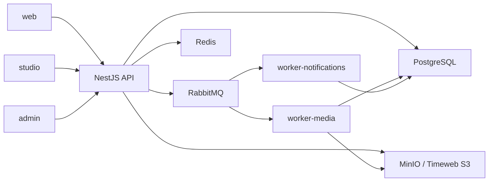

# Архитектура quakke-video

## Цель

`quakke-video` — учебный видеохостинг с production-like требованиями. Целевой продукт
состоит из пользовательского сайта, студии автора, админки, API и фоновой обработки.

Основные продуктовые области:

- регистрация, авторизация, профиль и настройки;
- рекомендации, категории, теги и поиск;
- просмотр видео, реакции, комментарии и подписки;
- плейлисты, история и уведомления;
- resumable upload и управление метаданными;
- аналитика и управление контентом автора;
- роли, модерация, жалобы, баннеры и партнёрские заявки.

Это целевой scope, а не описание уже реализованной функциональности. Текущее состояние
зафиксировано в [корневом README](../../README.md).

## Архитектурный подход

Проект строится как modular monolith + workers:

- бизнес-логика живёт в одном NestJS API с явными модульными границами;
- CPU/IO-heavy и отложенные операции выполняются отдельными workers;
- внешние контракты отделены от внутренних реализаций;
- модули выносятся в самостоятельные сервисы только после появления реальной причины.

## Runtime-приложения

| Проект                 | Ответственность                                             |
| ---------------------- | ----------------------------------------------------------- |
| `web`                  | публичный пользовательский видеохостинг                     |
| `studio`               | загрузки, видео, аналитика и настройки автора               |
| `admin`                | пользователи, роли, модерация, жалобы и аналитика платформы |
| `api`                  | бизнес-модули, GraphQL, upload REST и технические endpoint  |
| `worker-media`         | FFmpeg, HLS, thumbnails и media artifacts                   |
| `worker-notifications` | email и внутренние уведомления                              |

Workers запускаются через `NestFactory.createApplicationContext()` и не имеют
HTTP-сервера. Их readiness в будущем проверяется через broker connection, heartbeat,
metrics и queue monitoring.

## Shared packages

| Пакет                   | Назначение                                       |
| ----------------------- | ------------------------------------------------ |
| `@quakke/ui`            | React primitives, themes, tokens и accessibility |
| `@quakke/api-client`    | transport, сериализация и типизированные запросы |
| `@quakke/contracts`     | DTO, runtime schemas, queue/event contracts      |
| `@quakke/config`        | runtime-валидация env и config factories         |
| `@quakke/testing`       | общие fixtures, builders и test adapters         |
| `@quakke/eslint-config` | переиспользуемая база ESLint flat config         |

Shared packages не содержат продуктовой бизнес-логики. Приложения не импортируют код
друг друга. Фактические зависимости контролируются package manifests, Nx project graph
и ESLint boundaries.

## API protocols

GraphQL используется для пользовательских и административных бизнес-данных. REST
используется там, где протокол важнее гибкости запроса:

- resumable/multipart upload;
- healthcheck;
- технические и инфраструктурные endpoint.

Одна бизнес-операция не должна иметь две независимые реализации в GraphQL и REST.
Авторизация и бизнес-правила проверяются в API, а не только в UI.

## Данные и инфраструктура

- PostgreSQL — единственный источник истины для бизнес-данных.
- Redis — cache, rate limit, sessions/codes и временные счётчики.
- RabbitMQ — доставка фоновых команд и событий.
- MinIO — только локальный S3-compatible provider.
- Timeweb S3 — stage/production media и off-host PostgreSQL backups.

Stage и production используют отдельные databases, Redis, RabbitMQ, volumes и buckets,
но временно работают на одном VPS. Подробности находятся в
[infra/README.md](../../infra/README.md).

## Media flow

Целевой поток загрузки и обработки:

1. Клиент создаёт upload session через API.
2. Файл загружается частями напрямую в S3-compatible storage.
3. API фиксирует metadata и публикует versioned command в RabbitMQ.
4. `worker-media` идемпотентно создаёт HLS, thumbnails и технические metadata.
5. Worker сохраняет результат и публикует событие.
6. API делает видео доступным и создаёт уведомления/аналитические события.

Upload и background processing не должны удерживать долгую HTTP-транзакцию API.

## Надёжность очередей

RabbitMQ предоставляет at-least-once delivery, поэтому:

- consumer идемпотентен;
- message acknowledgement выполняется после успешного commit результата;
- временные ошибки имеют ограниченные retry с delay/backoff;
- неисправимые сообщения попадают в DLQ;
- event/command contracts версионируются;
- correlation ID проходит через API, очередь, workers и логи.

## Масштабирование

Текущий modular monolith позволяет масштабировать API и workers независимо как
процессы/контейнеры. Вынос модуля в сервис оправдан только при отдельном профиле
нагрузки, требованиях изоляции, независимом lifecycle команды или deployment.

Планируемый порядок инфраструктурного разделения:

1. S3 уже вынесен из VPS.
2. PostgreSQL переносится в managed service или отдельный host.
3. `worker-media` переносится на compute node.
4. Stage получает отдельный VPS.
5. Остальные компоненты разделяются только по измеренной необходимости.

## Архитектурные решения

Причины ключевых решений зафиксированы в [ADR](../adr/README.md):

- modular monolith + workers;
- GraphQL/REST responsibilities;
- RabbitMQ для асинхронной обработки;
- local/stage/production и delivery flow.
